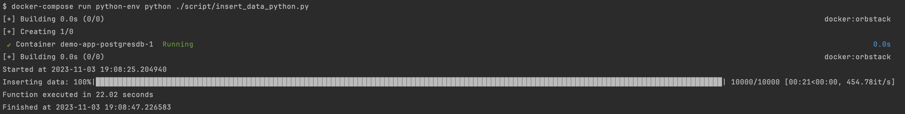
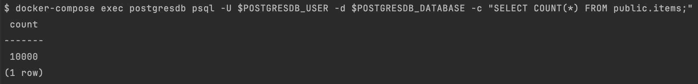
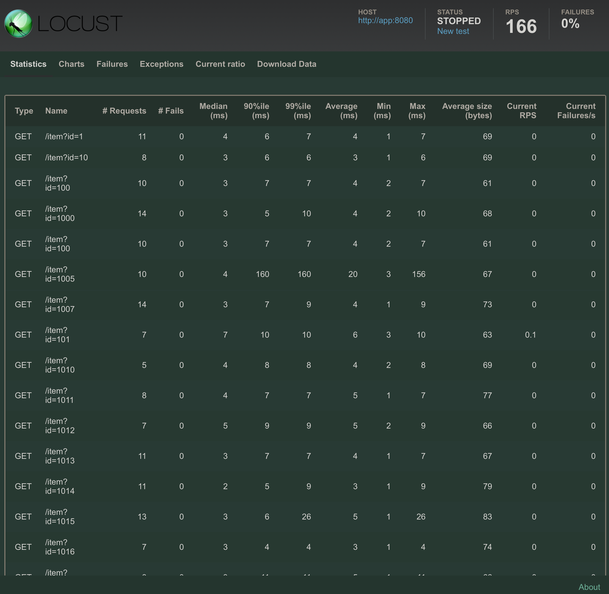
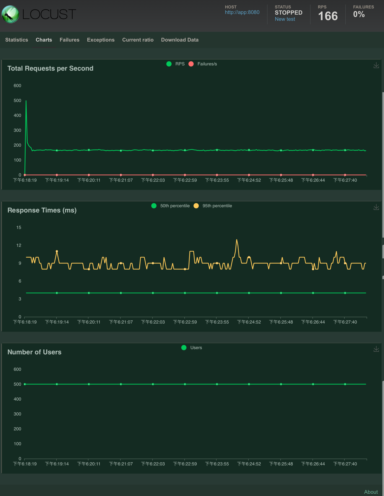

# docker-compose-spring-boot-postgres
A Java Spring and PostgreSQL project with CRUD API operations, 
containerized setup, OpenAPI-compliant documentation, pre-filled data, 
and Python Locust load tests for high concurrency simulation in Dockerized 
environments.

## Target
1. 請實作一個 Java Spring Framework project
   可對 PostgreSQL 做存取
   POST /item
   GET /item?id=**
   Reference :
   https://github.com/bezkoder/docker-compose-spring-boot-postgres

2. https://swagger.io/specification/
   請參考 OpenAPI 3.0 的規範
   實作輸出 API Specification
   https://springdoc.org/

3. 在 Database 內存放上萬筆資料

4. 使用 python locust 對  GET API 做壓力測試
   模擬五百位使用者同時呼叫, 產出測試報告
   Reference: https://locust.io/

## Step 0. Init
Load parameters into shell environments
- `source .env`

## Step 1. Start Demo App
- `docker-compose up -d`

Make sure using `docker ps` command to check, `app, postgres, python`, 3 container is up

Demo App Home Page: http://localhost:8080

## Step 2. Test POST/GET Method
- `docker-compose exec python-env python ./script/tests_post_get_method.py`

Result

## Step 3. Check Database Table Content
- `docker-compose exec  postgresdb psql -U $POSTGRESDB_USER -d $POSTGRESDB_DATABASE -c "SELECT t.* FROM public.items t LIMIT 5;"`

After step 2., it should have 5 data in the table.

Result

## Step 4. Check OpenAPI 3.0
swagger-ui
- URL: http://localhost:8080/swagger-ui/index.html

Result

api-docs
- URL: http://localhost:8080/v3/api-docs

Result

## Step 4. Insert 10K Data Into Database
- Python lib Method with multi-processing
  - `docker-compose run python-env python ./script/insert_data_python.py`

Result

- Or you can use helper script [Import Table](./script/import_table.sh) to save your time
   - `./script/import_table.sh`

## Step 5. Check Table Count
- `docker-compose exec  postgresdb psql -U $POSTGRESDB_USER -d $POSTGRESDB_DATABASE -c "SELECT COUNT(*) FROM public.items;"`

Result

## Step 6. Locust Stress Test
For CLI
- ` docker-compose exec python-env /bin/bash -c "locust -f ./script/locust_items_test.py --headless --users 500 --spawn-rate 100 -H http://app:8080 --run-time 10m"`

For WebUI
- ` docker-compose exec python-env /bin/bash -c "locust -f ./script/locust_items_test.py --users 500 --spawn-rate 100 -H http://app:8080 --run-time 10m"`
- URL: http://localhost:8089

### Locust Stress Test Conditions and Results

- **Machine:** 2022 MacBook Air M2
- **CPU:** 8-core
- **RAM:** 24 GB
- **Operating System:** macOS 13.4.1
- **Test Conditions:**
   - **Users:** 500 simulated users
   - **Spawn Rate:** 100 users/sec
- **Results:**
   - **Requests Per Second (RPS):** 166
- **Note:** Performance metrics are specific to the mentioned machine and 
setup, and may vary on different hardware or configurations.

### 500 User Statistics

### 500 User Chart

## Remove All
- `docker-compose down --rmi all`

## Helper Scripts
Some helper scripts to make life easier
- [Load Database Table](./script/import_table.sh): `./script/import_table.sh`
- [Export Database Table](./script/export_table.sh): `./script/export_table.sh`
- [Simple Test POST Script](./script/tests_post_method.sh): `./script/tests_post_method.sh`
- [Simple Test GET Script](./script/test_get_method.sh): `./script/test_get_method.sh`
