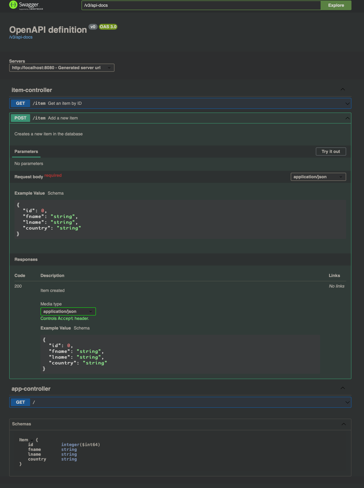

# docker-compose-spring-boot-postgres
## Target
1. 請實作一個 Java Spring Framework project
   可對 PostgreSQL 做存取
   POST /item
   GET /item?id=**
   Reference :
   https://github.com/bezkoder/docker-compose-spring-boot-postgres

2. https://swagger.io/specification/
   請參考 OpenAPI 3.0 的規範
   實作輸出 API Specification
   https://springdoc.org/

3. 在 Database 內存放上萬筆資料

4. 使用 python locust 對  GET API 做壓力測試
   模擬五百位使用者同時呼叫, 產出測試報告
   Reference: https://locust.io/

## Step 0. Init
Load parameters into shell environments
- `source .env`

## Step 1. Start Demo App
- `docker-compose up`

Make sure `docker ps`, 3 container is up

Demo App Home Page: http://localhost:8080

## Step 2. Test POST/GET Method
- `docker-compose exec python-env python ./script/tests_post_get_method.py`

Result

## Step 3. Check database table content
- `docker-compose exec  postgresdb psql -U $POSTGRESDB_USER -d $POSTGRESDB_DATABASE -c "SELECT t.* FROM public.items t LIMIT 5;"`

After step 2., it should have 5 data in the table.

Result

## Step 4. Check OpenAPI 3.0
swagger-ui
- URL: http://localhost:8080/swagger-ui/index.html

Result

api-docs
- URL: http://localhost:8080/v3/api-docs

Result

## Step 4. Insert 10K data into Database
- Python lib Method
  - `docker-compose exec python-env python ./script/insert_data_python.py`
- POST Method

## Step . Check Table Count
- `docker-compose exec  postgresdb psql -U $POSTGRESDB_USER -d $POSTGRESDB_DATABASE -c "SELECT COUNT(*) FROM public.items;"`

## Remove All
- `docker compose down --rmi all`